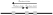

```@meta
EditURL = "inference.jl"
```

# Inference and model evaluation
In this section, we go through the process of estimating the parameters of the model
and evaluating the fitted model.

## Simulating synthetic datasets
The method proposed by Ringbauer et al. (2017) makes some assumptions to approximate the evolution
of a population in a continuous space. We refer to the `Theory overview` for an introduction
to the underlying theory. In any case, we advise researchers to simulate synthetic data that resembles
the empirical data according to their expertise. This is a crucial step to determine the expected
performance of the method and to guide different steps of the pre-processing strategy (such as which software
to use to detect identity-by-descent blocks or how to bin the observed data).

For this purpose, we provide a `SLiM` model to simulate an individual-based population in a continuous
space as well as two scripts that fit the model with either error-free identity-by-descent blocks
or blocks detected using state-of-the-art software and compare it with the ground-truth parameters.
Such models can be found at [simulations directory](https://github.com/currocam/IdentityByDescentDispersal.jl/tree/main/simulations) and might be adapted to your specific needs.

## Processing pipeline
Inferring the effective density and dispersal rate from empirical datasets requires running an identity-by-descent detection
software across different phased VCF files, post-processing them, and aggregating them appropriately. This
procedure is error-prone and time-consuming.

To facilitate the analysis, we provide a [Snakemake pipeline](https://github.com/currocam/IdentityByDescentDispersal.jl/blob/main/Snakefile) that can be used to perform a complete analysis,
from detecting IBD blocks using HapIBD, post-processing them with Refined IBD, producing a CSV directly compatible
with this package, and, optionally, finding a preliminary maximum likelihood estimate of the effective density.
Effective dispersal rate. [Snakemake](https://snakemake.readthedocs.io/) is a popular tool in bioinformatics
and it allows easy parallelization across multiple cores or jobs when submitting to a cluster via SLURM, as well as
automatically managing dependencies via Conda or Apptainer containers. Most of the time, running such a pipeline
would require a single-command such as:
``` bash
snakemake --configfile config.yaml --cores 8 --sdm conda
```
The pipeline is configured via a configuration YAML file. An example of such a configuration file can be found [here](https://github.com/currocam/IdentityByDescentDispersal.jl/blob/main/.test-workflow/config.yaml).
We refer to the [extensive documentation of Snakemake](https://snakemake.readthedocs.io/) for more information.

## Model inference
Next, we exemplify the common steps of an analysis using `IdentityByDescentDispersal`. First, we load a synthetic
dataset for which we know the ground truth. This is the dataset we simulated when showcasing how to [simulate synthetic
datasets using SLiM](https://github.com/currocam/IdentityByDescentDispersal.jl/blob/main/simulations/simulate_constant_density_ground_truth.md).

````@example inference
using JLD2, DataFrames, IdentityByDescentDispersal, Turing
data = load("../data/constant_density.jld2")
ground_truth = (data["local_density"], data["dispersal_rate"])
````

The `IdentityByDescentDispersal` is designed to be compatible with existing statistical software. Here, we decide to
Use the `Turing` package, which is the most popular Bayesian modelling framework in Julia. Let's consider the following model:

````@example inference
@model function constant_density(df, contig_lengths)
    De ~ Truncated(Normal(1000, 100), 0, Inf)
    σ ~ Truncated(Normal(1, 0.1), 0, Inf)
    Turing.@addlogprob! composite_loglikelihood_constant_density(De, σ, df, contig_lengths)
end
m = constant_density(data["df"], data["contig_lengths"])
````

The `IdentityByDescentDispersal` is compatible with automatic differentiation. Therefore, we can use standard
Hamiltonian Monte Carlo algorithms such as `NUTS()` to estimate the posterior distribution.

````@example inference
chains = sample(m, NUTS(), MCMCThreads(), 1000, 4);
nothing #hide
````

When fitting models with power-densities (i.e. using `composite_loglikelihood_power_density`), be aware that
the $\beta$ parameter controls the mean-square differentiability of the composite likelihood (through modified
second-kind Bessel function). If you run into issues, we suggest that:
- reparametrize the model (perhaps using a custom function via the `composite_loglikelihood_custom` interface).
- tighten the priors to constrain the space of parameters to a region where gradients are defined.
- use gradient-free inference methods such as `Nelder-Mead` when computing maximum likelihood estimates or `Metropolis-Hastings` when doing Bayesian inference.
## Model diagnosis
Diagnosing the posterior samples obtained via Markov Chain Monte Carlo is a crucial step in any Bayesian inference.
We refer to existing resources such as this lecture on [Bayesian modelling in Biostatistics](https://myweb.uiowa.edu/pbreheny/uk/teaching/701/notes/3-5.pdf)
Most popular approaches involve calculating quantities such as the effective number of samples (ESS)
and $\hat {R}$, which can be computed directly from `Turing` output.

As a rule of thumb, we aim to run the chain long enough to obtain an ESS greater than 100.

````@example inference
ess(chains) |> DataFrame
````

A $\hat {R}$ greater than 1.05 indicates the chains have not mixed well.

````@example inference
rhat(chains) |> DataFrame
````

Convergence issues can also be inspected through a `traceplot`:

````@example inference
using Plots, StatsPlots
traceplot(chains)
````

## Visualizing the posterior
After finishing the sampling process and assessing convergence, we can visualize the estimated posterior
distribution of the parameters and compare it with the prior distribution and the ground-truth:

````@example inference
using Distributions
p1 = plot(
    Truncated(Normal(1000, 100), 0, Inf),
    label = "Prior",
    xlab = "Effective population density",
    ylab = "Density",
)
density!(p1, chains[:De][:], label = "Posterior")
vline!(p1, [ground_truth[1]], label = "Ground-truth")

p2 = plot(
    Truncated(Normal(1, 0.1), 0, Inf),
    label = "Prior",
    xlab = "Effective dispersal rate",
    ylab = "Density",
)
density!(p2, chains[:σ][:], label = "Posterior")
vline!(p2, [ground_truth[2]], label = "Ground-truth")
plot(p1, p2, layout = (2, 1), size = (600, 800))
````

Notice that, although the inference is accurate, we do not expect the posterior estimates to have nominal
coverage (e.g., that a 90% credibility interval contains the true parameter 90% of the time). This is because we are assuming every pairwise observation is independent when constructing the
composite likelihood and therefore we are overconfident in our estimations. In their publication, Ringbuaer et al. (2017)
computed a bootstrapping confidence interval of the maximum-likelihood estimate but still do not achieve
nominal coverage.

A bootstrapping confidence interval can be easily computed with the `maximum_likelihood` function and taking
samples with replacement of the rows of the `DataFrame`. Notice, however, that other resampling schemes are possible.
We advise you to experiment with different approaches and evaluate the performance with simulated datasets.

````@example inference
nboots = 100
boots = zeros(2, nboots)
df = data["df"]
for i = 1:nboots
    df_resampled = df[sample(1:nrow(df), nrow(df), replace = true), :]
    mle = maximum_likelihood(constant_density(df_resampled, data["contig_lengths"]))
    boots[:, i] = mle.values
end
conf_De = quantile(boots[1, :], [0.025, 0.975])
conf_σ = quantile(boots[2, :], [0.025, 0.975])
DataFrame(
    parameter = ["De", "σ"],
    confidence_interval95 = [conf_De, conf_σ],
    ground_truth = [ground_truth[1], ground_truth[2]],
)
````

## Interpreting the output
Finally, we provide some references on how to interpret the results and relate them to the biological context.

### Effective population density
The effective population density (De) is simply the inverse of the coalescent rate of lineages that become very close to each other.
It is equivalent to the effective population size of every deme in a stepping stone model where demes are separated by one distance unit.

The estimate is most informative of recent demographic events as it is calculated from long identity-by-descent blocks that typically arise recently.
We can get an idea of the temporal time-scale by looking at the theoretical predictions under the estimated demographic model.

In a Bayesian setting, this sort of information is known as a posterior predictive distribution. Next, we provide a snippet of code
that demonstrates how to do this provided a MCMC sample.

````@example inference
let
    grid_times = 1:100
    L = 0.05
    grid_r = [0.1, 0.5, 1.0]
    colors = [:blue, :red, :green] # Define colors for each r
    De(t, params) = params[1] # Custom De(t) parametrization
    p1 = plot(xlabel = "Time (generations ago)", ylabel = "Density shared IBD blocks")
    posterior = sample(chains, 100)
    for (i, r) in enumerate(grid_r)
        first_line = true
        for (D, sigma) in zip(posterior[:De], posterior[:σ])
            params = [D]
            dens = age_density_ibd_blocks_custom(
                grid_times,
                r,
                De,
                params,
                sigma,
                L,
                data["contig_lengths"],
            )
            plot!(
                p1,
                grid_times,
                dens,
                label = first_line ? "r=$r" : "",
                color = colors[i],
                alpha = 0.1,
            )
            first_line = false
        end
    end
    display(p1)
end
````

An equivalent plot can be done in a likelihood (frequentist) setting. For example, by calculating
the densities for each bootstrap replicate.

````@example inference
let
    grid_times = 1:100
    L = 0.05
    grid_r = [0.1, 0.5, 1.0]
    colors = [:blue, :red, :green] # Define colors for each r
    De(t, params) = params[1] # Custom De(t) parametrization
    p1 = plot(xlabel = "Time (generations ago)", ylabel = "Density shared IBD blocks")
    for (i, r) in enumerate(grid_r)
        first_line = true
        for j = 1:nboots
            D, sigma = boots[:, j]
            params = [D]
            dens = age_density_ibd_blocks_custom(
                grid_times,
                r,
                De,
                params,
                sigma,
                L,
                data["contig_lengths"],
            )
            plot!(
                p1,
                grid_times,
                dens,
                label = first_line ? "r=$r" : "",
                color = colors[i],
                alpha = 0.1,
            )
            first_line = false
        end
    end
    display(p1)
end
````

We expect to observe a decay in the density of expected shared IBD-blocks with time. The previous plot can be used
to determine some time interval $(1, t)$ from which we expect most of the signal to have arisen. This recipe
is useful for identifying the time-span of the estimated demography and can be applied to other demographic models as well.

### Effective dispersal rate
Perhaps unintuitively, the mean per-generation dispersal distance when we average with respect to both parents is not necessarily equivalent
to the mean per-generation dispersal distance when we average across single generations. From population genetic data, we can estimate the latter (
refer to the `Theory overview` section for more details). Therefore, interpreting the estimated effective dispersal rate in the context of
the ecology of one population has to be done carefully.

For example, consider a population with two separate sexes for which there are differences in the process of dispersal.
Such differences arise naturally when considering the effect of mating systems on dispersal patterns. For simplicity,
let's consider a 1-dimensional space where individuals can only move left or right as shown in the figure below.



Let's assume the displacement between the mother and the offspring, $d_{\text{mother-child}}$, is distributed
according to a normal distribution with a mean of zero and a variance of $\sigma_D^2$ and
the displacement between the father and the mother, $d_{\text{mother-father}}$, is also distributed according to a normal distribution with a mean of zero and a variance of $\sigma_M^2$.
Because the mating process (that determines the displacement from the mother to the father) is independent from the specific dispersal process of the offspring
(that determines the displacement from the mother to the offspring), then the displacement between the father and the offspring is distributed
according to a normal distribution with a mean of zero and a variance of $\sigma_D^2 + \sigma_M^2$.

As mentioned earlier, what we can estimate is the mean per-generation dispersal of the "lineages". Because the lineage is either inherited from the mother or the father,
the displacement is distributed as a mixture of two normal distributions. If sex ratio is 0.5, then the displacement is distributed
as a mixture of two normal distributions with weights $w = [0.5, 0.5]$. This distribution has a mean of zero and a variance of $\sigma_D^2 + 0.5\sigma_M^2$ but it is *not*
normally distributed. Therefore, and under these assumptions, what we can estimate from genetic data is actually
$$\sigma = \sqrt{0.5\sigma_D^2 + 0.5(\sigma_D^2+\sigma_M^2)} = \sqrt{\sigma_D^2 + 0.5\sigma_M^2)}$$
and it is not possible to separate the effects of $\sigma_D$ and $\sigma_M$ without additional information. If a priori information is available,
it is possible to obtain estimates of both $\sigma_D$ and $\sigma_M$ that are consistent with the observed data. However, this requires additional
consideration as the posterior distribution will be multimodal.

````@example inference
@model function constant_density2(df, contig_lengths)
    De ~ Truncated(Normal(1000, 100), 0, Inf)
    σ_D ~ Truncated(Normal(1, 0.1), 0, Inf)
    σ_M ~ Truncated(Normal(0.1, 0.01), 0, Inf)
    σ := sqrt(σ_D^2 + 0.5 * σ_M^2)
    Turing.@addlogprob! composite_loglikelihood_constant_density(De, σ, df, contig_lengths)
end
````

As mentioned earlier, the per-generation distance averaging across lineages is not necessarily equal to the mean per-generation
distance when we average with respect to both mother and father. Notice that the average displacement is defined as
$$\hat d = 0.5 d_{\text{mother-child}} + 0.5 (d_{\text{mother-child} - d_{\text{mother-father}}})$$
which is distributed as a normal distribution with mean zero and variance $\sqrt{\sigma_{D}^{2} + 0.25 \sigma_{M}^{2}}$.

---

*This page was generated using [Literate.jl](https://github.com/fredrikekre/Literate.jl).*
